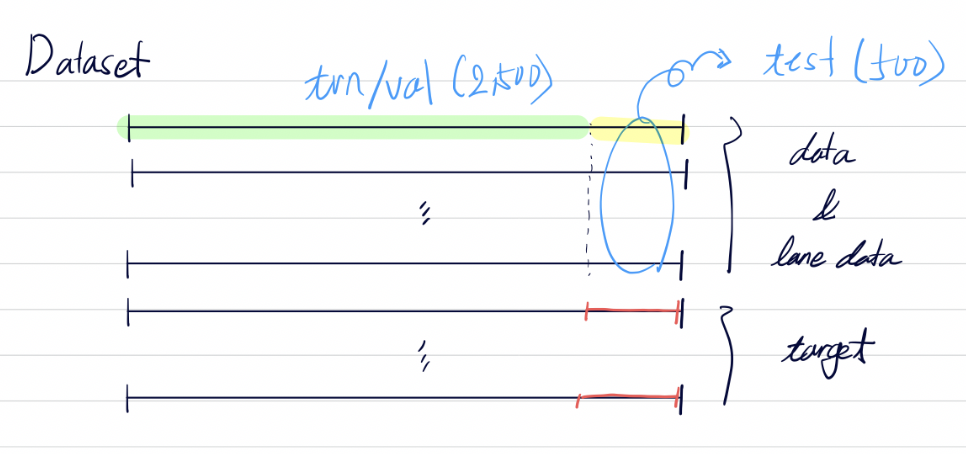

## Dataset 

- `train/val` dataset (2,500 time points)
- `test` dataset (500 time points)
    - squential dataset의 마지막 time points로 주어짐.

- train/val dataset `fold split` strategy
    - 학습 데이터셋 중간에 검증 데이터셋을 설정하면 연속성이 끊어지기 때문에 train/val dataset의 *앞쪽* 또는 *뒷쪽*을 validation dataset으로 정의
    - train/val dataset의 `y` plot을 고려하면 class imbalance 문제가 다소 내포되어 있는 문제로 여겨짐.
    - Leave-one-out을 활용하되 아래와 같이 네가지로 정의
        - `val-pre-500`는 주어진 train/val 데이터셋의 *처음* 부분 *500* time points를 validation dataset 나머지를 train dataset으로 활용
        - `val-pre-1000`는 주어진 train/val 데이터셋의 *처음* 부분 *1,000* time points를 validation dataset 나머지를 train dataset으로 활용
        - `val-post-500`는 주어진 train/val 데이터셋의 *마지막* 부분 *500* time points를 validation dataset 나머지를 train dataset으로 활용
        - `val-post-10900`는 주어진 train/val 데이터셋의 *마지막* 부분 *1,000* time points를 validation dataset 나머지를 train dataset으로 활용
    - 최종적으로 획득되는 네개 모델의 앙상블 모델을 제안해보면 좋을 것으로 사료됨.