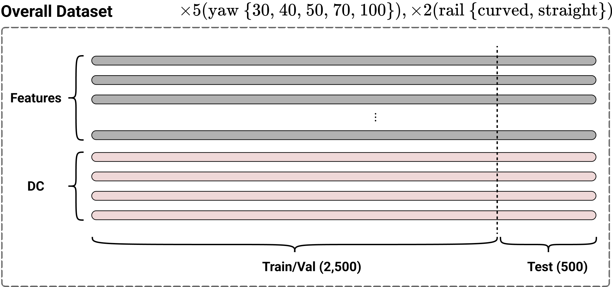
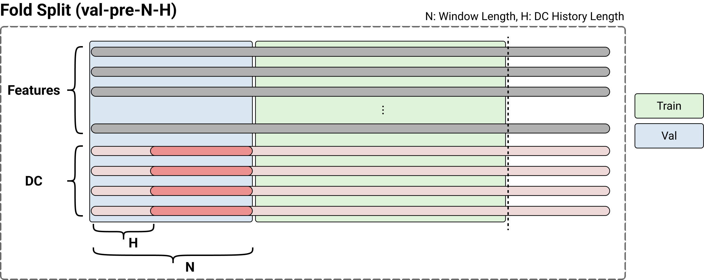
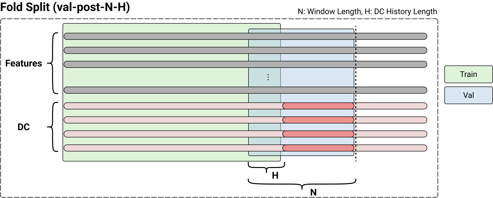
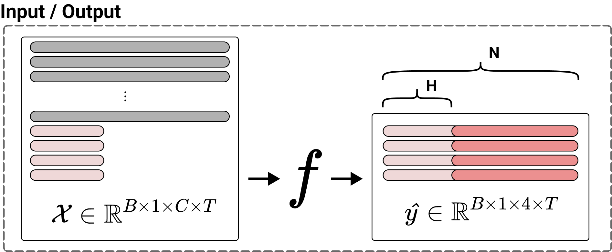

# Dataset 

### `train/val` dataset (2,500 time points)
    sequential dataset depending on the followings :
        [yaw damper (30, 40, 50, 70, 100)]
        ["curved", "straight"]
### `test` dataset (500 time points)
    sequential dataset의 마지막 time points

## Overall Dataset


## Train/Val dataset `fold split` strategy
- 학습 데이터셋 중간에 검증 데이터셋을 설정하면 연속성이 끊어지기 때문에 train/val dataset의 *앞쪽* 또는 *뒷쪽*을 validation dataset으로 정의
- train/val dataset의 `y` plot을 고려하면 class imbalance 문제가 다소 내포되어 있는 문제로 여겨짐.
- Leave-one-out을 활용하되 아래 그림과 같이 정의하고 변수 `N`, `H`를 통해서 fold split 및 모델의 입출력을 정의
    - `val-pre-N-H`
    - `val-post-N-H`
- 최종적으로 획득되는 모델들의 앙상블 모델을 제안해보면 좋을 것으로 사료됨.

## 선로 정보
거리 별 선로의 정보가 담겨져있는데, 이게 선로유형별로 정보가 달라서 모델을 따로 만드는 것이 좋을 것으로 보인다.
```
       type                      name                       description
0     curve                  Distance                             거리[m]
1     curve                 Curvature                          곡률[1/km]
2     curve           Vertical offset                      선로중심부 높이[mm]
3     curve        Cross level offset                            캔트[mm]
4  straight                  Distance                             거리[m]
5  straight  Cross level irregularity  우측 선로에 대한 좌측 선로 높이차(캔트) 불규칙도[mm]
6  straight    Curvature irregularity                 곡선에 대한 불규칙도[1/km]
7  straight      Lateral irregularity                       수평 불규칙도[mm]
8  straight     Vertical irregularity                       수직 불규칙도[mm]
9  straight           Gauge variation           선로 게이지(좌우거리차이) 불규칙도[mm]
```




## Input & Output


